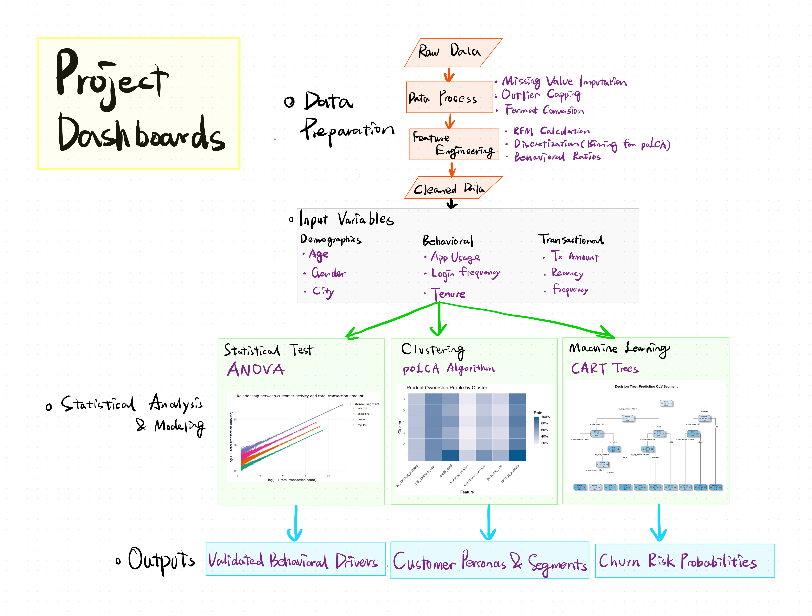

## 1. Motivation

The highly competitive financial technology (Fintech) sector is characterized by low switching costs for customers. Retaining customers and maximizing their lifetime value are paramount. While standard descriptive dashboards provide high-level summaries, they often fail to deliver actionable insights for marketing and retention teams. 

Inspired by the power of visual analytics, our team aims to create an interactive R Shiny Application. This app will go beyond static reporting, allowing Fintech marketing managers to dynamically explore customer behaviors, segment users through unsupervised learning, and simulate churn risks using predictive tree models. By doing so, we aim to "hook" the hidden patterns that drive customer loyalty and profitability.

## 2. Scope and Analytical Approach

### 2.1 Scope
Our analysis will focus on a comprehensive dataset from a Colombian Fintech company, containing both customer-level demographic information (e.g., Age, Income Bracket, Satisfaction Scores) and aggregated transaction-level data (e.g., Average Transaction Amount, Total Transaction Count).

### 2.2 The Three-Pillar Approach
To address the business objectives systematically, our team has structured the Shiny Application around three analytical pillars, matching our team's specific research modules:

| Pillar | Analytical Method | Focus | Business Value |
|:---|:---|:---|:---|
| **1. Confirmatory Data Analysis (CDA)** | Statistical Tests (Kruskal-Wallis, Spearman) & Correlation Heatmaps | Testing hypotheses on income vs. transaction volume, and app engagement vs. churn risk. | Validating predefined business assumptions with rigorous statistical testing. |
| **2. Customer Segmentation** | Latent Class Analysis (LCA) | Using demographic and product-ownership variables to discover hidden sub-populations (clusters). | Moving beyond basic rule-based segmentation to discover actual behavioral personas. |
| **3. Churn & CLV Prediction** | Decision Trees (`rpart`) | Extracting actionable rules for Churn Probability and Customer Lifetime Value tiers. | Enabling proactive retention strategies through interpretable machine learning rules. |

## 3. Application Architecture & Interactive Storyboard

To bridge our analytical backend with actionable business intelligence, we have designed an interactive R Shiny application. **Figure 3** (the storyboard below) synthesizes our entire workflow—demonstrating how multidimensional inputs (Demographics, Behavioral, and Transactional data) feed into our statistical and machine learning models, and ultimately manifest as interactive UI modules. 

The application will feature a coordinated, multi-tab layout following a standard sidebar-and-main-panel design, ensuring a seamless user experience. 

```{r}
#| label: fig-storyboard
#| fig-cap: "Figure 3: Integrated Analytical Storyboard and Shiny Application Flow"
#| fig-align: center
#| echo: false
#| out-width: "100%"


```

Below are the functional prototypes for the core modules mapped out in the storyboard:

### 3.1 Exploratory & Confirmatory Data Analysis (EDA/CDA) Module

As the foundational view, this module allows users to validate the initial statistical differences across multidimensional variables.

* **Interactivity:** Users can filter the dataset dynamically via the sidebar (e.g., by City, Gender, Income, or pre-defined Segments). A Log-Scale toggle will be provided to normalize highly skewed financial variables (such as Transaction Amount).
* **Outputs:** * **KPI Cards** for immediate summary metrics (e.g., average recency, total transaction volume).
  * **Side-by-side comparative charts** (e.g., boxplots for Income vs. Transaction Amount), supported by backend Kruskal-Wallis or ANOVA $p$-values to confirm statistical significance.
  * A **Spearman correlation heatmap** of behavioral and transactional variables to uncover internal consistencies before advanced modeling.

### 3.2 Latent Class Clustering (Customer Persona) Module

Drawing from the combined demographic, behavioral, and transactional features, this module translates the `poLCA` algorithm into interpretable customer segments.

* **Interactivity:** * A dropdown menu to select the specific categorical/binned variables to be included in the clustering procedure (e.g., age group, preferred transaction type, login frequency tiers).
  * A numeric selector to dynamically adjust the **Number of Classes ($k$)**.
* **Outputs:** * **Model Fit Charts** (AIC, BIC, Entropy) to help users visually justify the optimal cluster count.
  * A **Cluster Size Bar Chart** and a **Feature Probability Heatmap**, allowing marketing teams to build clear, actionable personas for each latent class.

### 3.3 Churn & CLV Decision Tree Module

This predictive module brings the CART machine learning model to the frontend, identifying the exact behavioral and demographic drivers of customer churn.

* **Interactivity:** * Users can dynamically select specific predictor variables to train the tree (e.g., omitting "Transaction Amount" to observe purely behavioral drivers).
  * A `sliderInput` for the **Complexity Parameter ($cp$)** and **Minimum Split** to visually grow or prune the tree in real-time, preventing overfitting.
* **Outputs:** * An interactive `visNetwork` decision tree, allowing users to zoom in, pan, and trace specific churn rules node-by-node.
  * A **Feature Importance Bar Chart** (`ggplot2`) to highlight the most critical variables, alongside a dynamically updated **Confusion Matrix** to evaluate the model's accuracy and sensitivity on the fly.

## 4. Scope of Work & Project Schedule

To ensure smooth IT application development and project management, the tasks are distributed as follows.

### 4.1 Task Allocation Matrix

| Phase | Task Description | Owner |
|:---|:---|:---|:---|:---|
| **1. Inception** | Project Ideation & Proposal Website | All Members | 
| **2. Data Prep & CDA** | EDA/CDA scripts & UI Design | Bao Sihan | 
| **3. Clustering** | Data Cleaning, PoLCA Modeling, Fit Metrics & Cluster Profiling | Bai Haotian | 
| **4. Predictive** | Decision Tree implementation & visNetwork integration | Shuang Zixin |
| **5. App Integration**| Combine 3 modules into a unified Shiny App | All Members | 
| **6. Handover** | Usability Testing, Final Report & Poster | All Members | 

### 4.2 Project Gantt Chart

We will use a Gantt chart to track our progress strictly against the academic calendar.

```{mermaid}
gantt
    title Visual Analytics Project Timeline
    dateFormat  YYYY-MM-DD
    axisFormat  %m-%d
    
    section 1. Inception
    Proposal & Website Setup   :done, p1, 2026-03-10, 2026-03-12
    
    section 2. EDA & CDA
    Exploratory Data Analysis  :active, d1, 2026-03-10, 3d
    Confirmatory Data Analysis :d2, after d1, 3d
    
    section 3. Advanced Analytics
    Latent Class Clustering    :m1, 2026-03-13, 6d
    Decision Tree Modeling     :m2, 2026-03-13, 6d
    
    section 4. Shiny App
    UI/UX Storyboarding        :s1, 2026-03-19, 4d
    Dashboard Integration      :s2, after s1, 8d
    
    section 5. Finalization
    Testing & Bug Fixing       :f1, 2026-03-29, 4d
    User Guide & Final Poster  :f2, after f1, 4d
```


